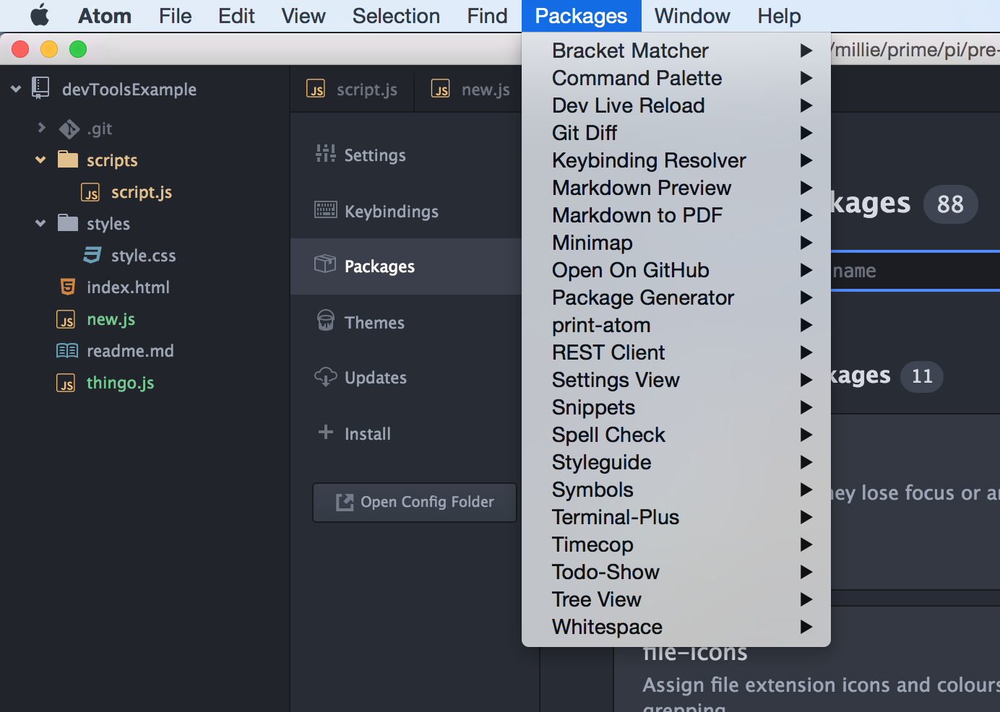

Coding with Atom (our IDE)
=========

Let's install Atom and a few useful plugins to help you work more affectively. Within Atom is where you'll be writing your code so it is kinda a big deal.

Steps
------
1. [Download Atom](#download-atom)
2. [Explore Default Functionality / Core Packages](#explore-default-functionality--core-packages)
3. [Install Community Packages](#install-community-packages)

### 1 | Download Atom

1. Download from here: [https://atom.io/](https://atom.io/)
2. After downloading drag the Atom icon from Downloads to the Applications folder.

3. To keep Atom in your doc, right click on the open application item in your doc, select options and keep in doc.

### 2 | Explore Default Functionality / Core Packages
Atom is the 'hackable text editor'. This means that the community that uses it, extends it via packages they write to add new functionality. As these packages become popular the "maintainers" (programmers that work on and are responsible for a software project) of atom can decide to make functionality default.

To see what is installed by default or enable it, go to the preferences menu (also called settings). This is located in the Atom menu, select Preferences. A new tab will open called **Settings**. On the left hand side of this screen you should see a series of options: Settings, Keybindings, Packages, Themes, Updates, and Install. Select **Packages**.

### 3 | Install Community Packages

You can install the community packages. Here is a small list of some suggested ones. Note, some packages need you to restart atom before they take effect.

- [linter](https://atom.io/packages/linter)
- [linter-jshint](https://atom.io/packages/linter-jshint)
- [minimap](https://atom.io/packages/minimap)
- [open-in-browser](https://atom.io/packages/open-in-browser)

There are two ways to install community packages in atom. The first way is described below. If you are interested in installing things via the command line, there is an [atom package manager (apm)](http://flight-manual.atom.io/using-atom/sections/atom-packages/#command-line).

##### Install from Preferences

1. In the Preference menu, click **Install** on the left selection. 
2. In the search box, type the exact name of the package from the list above. As you see in the picture below many matches come up. 
3. Find the correct package in the list and click the blue install button. 

**NOTE:** You might need to restart atom for the package to start working.

I already have installed minimap, so I don't have a blue button.

Some packages require you launch them from the package menu.

Remember, we are all in this together and the Slack channel is there to help. If you are having troubles ask there, if you figured something out that could help others also share it there.
