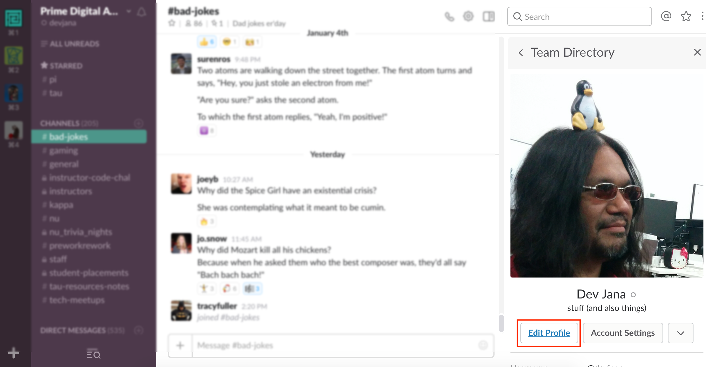
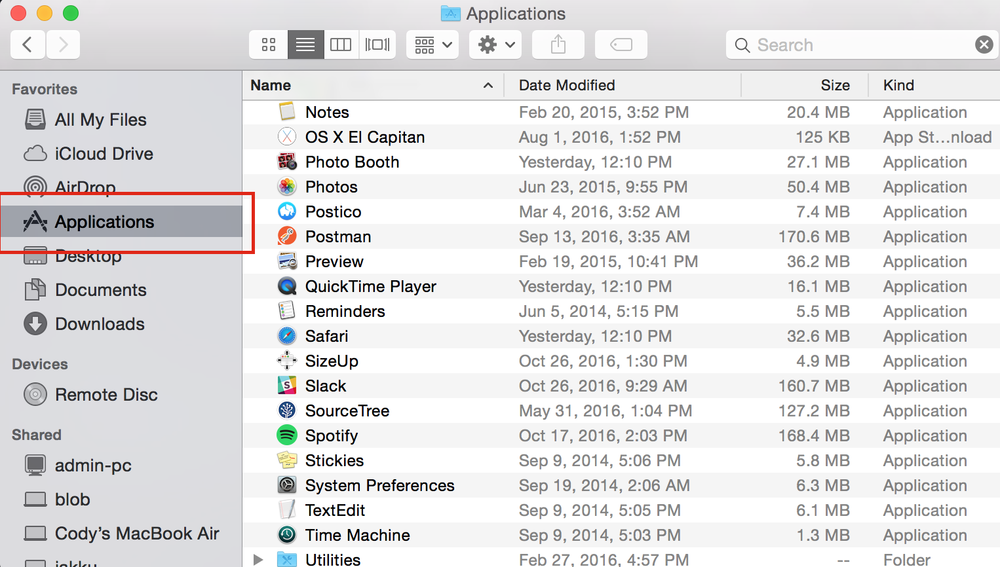
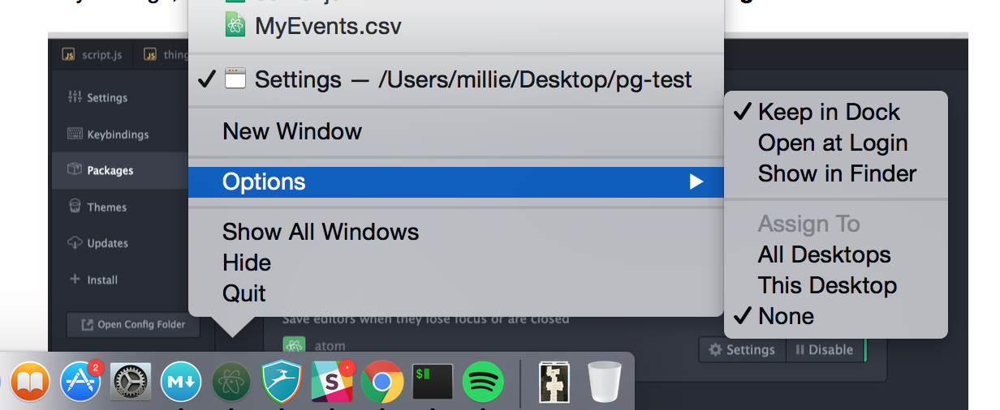
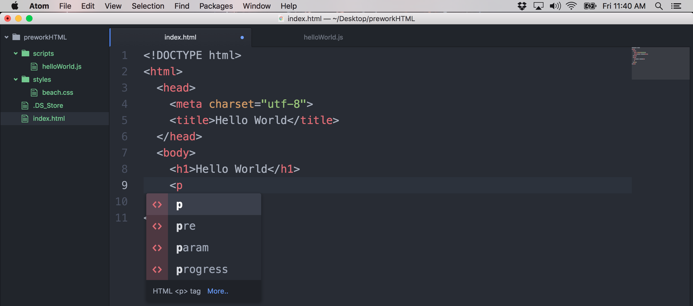

Prework Week 1
==============
Welcome to Prework at Prime Digital Academy! In week 1 of Prework we'll get you set up with the basics:

* Slack (our chat program)
* Atom (our IDE - Integrated Development Editor)
* Git (our version control)
* Adding Javascript to an HTML page
* Using Github
* Turning in your work via the Prime Academy Assignment App

This will take some time and will require installing some programs on your Mac. So get started early in the week and spread the work throughout.

By the end of this week, you'll be all set up for the next few months. You will have stepped through the process of setting up a simple page with javascript, posted it to the Internet, turned it in through Prime's Assignment App, and have started using internet chat to address technical ideas.

Let's get started! 

Slack (our chat program):
-------------------------
Slack is a super popular chat program within the industry and you will find it ubiquitous throughout your time at Prime. Getting comfortable with using Slack is incredibly important and you'll want to make its regular use a habit ASAP.

You should have already been invited to the Slack Channel for your cohort and we recommend you install the slack app: https://slack.com/downloads/

Note: There is also a Slack app for mobile devices!

Make sure you set up your profile correctly. Once logged in, click on your user name and select "Profile & Account" from the popup menu.


Next, click "Edit Profile" in the profile overview.


Everyone should use their actual first and last name and a relatively recent pic of themselves for their profile.


There are many channels other than the one for your cohort. Take a few moments to browse them by clicking the word "Channels" (not the + next to channels). You can subscribe to any of the public channels at Prime.


You can also "star" channels that are high priority for you. If you subscribe to multiple channels, we highly recommend you star your cohort's channel. 

Please, feel free to jump in to channels and join the conversations!

Atom (our IDE):
=========

Let's install Atom and a few useful plugins to help you work more affectively. Within Atom is where you'll be writing your code so it is kinda a big deal.

Steps:
------
- [Download Atom](#download-atom)
- [Default Functionality / Core Packages](#default-functionality--core-packages)
- [Community Packages](#community-packages)
- [Settings](#settings)

### Download Atom
- Download from here: [https://atom.io/](https://atom.io/)
- After downloading drag the Atom icon from Downloads to the Applications folder. 

- To keep Atom in your doc, right click on the open application item in your doc, select options and keep in doc.


-

### Default Functionality / Core Packages
Atom is the 'hackable text editor'. This means that the community that uses it, extends it via packages they write to add new functionality. As these packages become popular the "maintainers" (programmers that work on and are responsible for a software project) of atom can decide to make functionality default. 

To see what is installed by default or enable it, go to the preferences menu (also called settings). This is located in the Atom menu, select Preferences. A new tab will open called **Settings**. On the left hand side of this screen you should see a series of options: Settings, Keybindings, Packages, Themes, Updates, and Install. Select **Packages**.


### Community Packages

You can install the community packages. Here is a small list of some suggested ones. Note, some packages need you to restart atom before they take effect.

- [linter](https://atom.io/packages/linter)
- [linter-jshint](https://atom.io/packages/linter-jshint)
- [minimap](https://atom.io/packages/minimap)
- [open-in-browser](https://atom.io/packages/open-in-browser)

There are two ways to install community packages in atom. The first way is described below. If you are interested in installing things via the command line, there is a hard mode below that describes atom package manager (apm).

##### Install from Preferences
In the Preference menu, click **Install** on the left selection. In the search box, type the exact name of the package from the list above. As you see in the picture below many matches come up. Find the correct one and click the blue install button. Again, you might need to restart atom for the package to start working.


I already have installed minimap, so I don't have a blue button. 

Some packages require you launch them from the package menu. 


Remember, we are all in this together and the Slack channel is there to help. If you are having troubles ask there, if you figured something out that could help others also share it there. 

Our first Javascript+HTML:
======================
Now then. Let's make a web page with some Javascript using our new IDE Atom!

We recommend you create a folder for Prime work with a folder for prework within. Let's create a new folder in prework for this project. I've called mine "preworkHTML", but you may choose to name yours something like "week1".

Open Atom. Choose File-Open from the main menu and browse to your folder to open. You'll see your folder listed in the left panel in Atom. Right click on this folder and choose "New File" from the popup menu and create an "index.html" file:


Continue this process to create a "scripts" folder. Create a file called "helloWorld.js" in the "scripts" folder. This will is our (first) JavaScript file. 

-

Now, let's get into our HTML file. Open "index.html" by clicking on it's tab at the top of Atom. Type in ```html``` and you'll see that Atom anticipates that you are trying to create an HTML file 


Click TAB and you'll see that Atom gives you some scaffolding for a basic HTML page.


Let's give our little page a Title of "Hello World" and add a H1 in the body as well: 



You may have noticed that Atom tries to anticipate what you are trying to add. This is because Atom knows it is an HTML file. Add a p tag by typing ```<p``` and click TAB. Note that Atom finishes the opening tab as well as provides you with the closing p tag. 

Give this paragraph tag some text of "Check the console for javascript output"

-

Now let's open "helloWorld.js". simply add the following line:

```javascript
console.log( 'Hello World!' );
```

This will display in a part of the browser called the "Console". We'll see this shortly.

-

We'll need to "source" the js file in the HTML. This is what connects the javascript to the HTML. Similar to how you used "link" previously to add CSS to an HTML file.

In the "head" section of the HTML, start typing ```src``` and Atom will anticipate you sourcing in a script file. 


"Source" in our js file as follows: 


Save all your work and let's get ready to see how things are working!

-
Open the index.html file in Chrome. Rt-click and choose "Inspect" from the popup menu:


This can aslo be opened by choosing View-Developer-Developer Tools:


In the Dev Tools panel, click on the "Console" tab to activate it. You'll see in there your "Hello World!" message.


Next Steps:
-----------
Create a CSS file, link it in and add some styling. You've now sourced in a javascript file and created a basic page that says hello to the world from you as a developer! Next, we'll use Git to post your work to Github. Then you'll learn how we turn in assignments on the Prime Assignment App. 


Git and Github:
=======================
Git
----
Now that you've built a page on your computer, we'll want it on github so it can be shared. We'll add one more tool to manage our files - Git. 

Open Terminal. This can be found in Applications-Utilities-Terminal:


............ TBA .........


Posting our work to Github:
===============================
Setup

Implementation

Next Steps

Turning in our work through the Assignment App:
======================
Setup

Implementation

Next Steps


