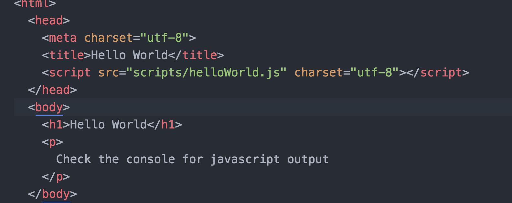
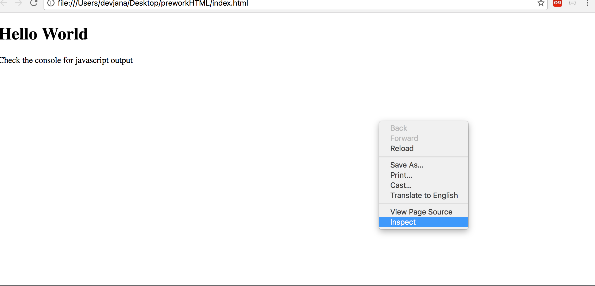
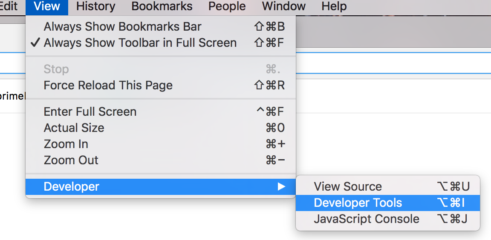

Prework Week 1
==============
Welcome to Prework at Prime Digital Academy! In week 1 of Prework we'll get you set up with the basics.

Click on each link below for instructions.

- [ ] [Slack (our chat program)](slack.md)
- [ ] [Atom (our IDE - Integrated Development Editor)](atom.md)

This will take some time and will require installing some programs on your Mac. So get started early in the week and spread the work throughout.

By the end of this week, you'll be all set up for the next few months.

Now, for your first assignment.

## Topics Covered

You will step through the process of

* setting up a simple page with JavaScript
* posting it to the Internet
* turning it in through Prime's Assignment App

## Assignment

Now then. Let's make a web page with some Javascript using our new IDE Atom!

### Creating folders for our work
We recommend you

1. create a *prime* folder for Prime work
2. create a *prework* folder inside of the *prime* folder

Finally, let's create a new folder inside of the *prework* folder for this project. I've called mine "preworkHTML", but you may choose to name yours something like "week1".

### Opening and setting up our project in Atom

1. Open Atom.
2. Choose "File-Open" from the main menu and browse to your folder to open. You'll see your folder listed in the left panel in Atom.
3. Right-click on this folder and choose "New File" from the popup menu and create an *index.html* file.

4. Repeat Step 3--choosing "New Folder" instead of "New File"--to create a *scripts* folder.
5. Create a file called *helloWorld.js* in the *scripts* folder. This is our (first) JavaScript file.

### Creating our web app

#### Editing our HTML file

Now, let's get into our HTML file. Open *index.html* by clicking on its tab at the top of Atom.

1. Type in `html` and you'll see that Atom anticipates that you are trying to create an HTML file.

2. Press the TAB key and you'll see that Atom gives you some scaffolding for a basic HTML page.

3. Let's give our page a `title` of "Hello World" and add a `h1` in the body as well.

4. You may have noticed that Atom tries to anticipate what you are trying to add. This is because Atom knows it is an HTML file. Add a p tag by typing `<p` and click TAB. Note that Atom finishes the opening tab as well as provides you with the closing p tag.
5. Give this paragraph tag some text content: "Check the console for javascript output".

#### Editing our JavaScript file

1. Open *helloWorld.js*.
2. Add the following line:

```javascript
console.log( 'Hello World!' );
```

This will display in a part of the browser called the console. We'll see this shortly.

#### Connecting our JavaScript and HTML

We'll need to "source" the .js file in the HTML. This is what connects the JavaScript to the HTML. This is similar to how you used `link` previously to add CSS to an HTML file.

1. In the `head` section of the HTML, start typing `src` and Atom will anticipate you sourcing in a script file.

2. "Source" in our js file as follows:

3. Save all your work and let's get ready to see how things are working!

#### Checking our work

1. Open the *index.html* file in Chrome.
2. Right-click and choose "Inspect" from the popup menu.

NOTE: This can aslo be opened by choosing View-Developer-Developer Tools.

3. In the Dev Tools panel, click on the "Console" tab to activate it. You'll see in there your "Hello World!" message.


#### Add some styling

Create a CSS file, link it in and add some styling.

### Git and Github

You've now sourced in a javascript file and created a basic page that says hello to the world from you as a developer! Next, we'll use Git to post your work to Github. Finally, you'll learn how we turn in assignments on the Prime Assignment App.

#### Git

Now that you've built a page on your computer, we'll want it on GitHub so it can be shared. We'll add one more tool to manage our files: Git.

1. Open Terminal. This can be found in Applications-Utilities-Terminal.

-

2. [Watch this video for instructions](https://vimeo.com/199694535)

#### Posting our work to Github

[Video](https://vimeo.com/199694621)

### Turning in our work through the Assignment App

[Video](https://vimeo.com/199694700)
