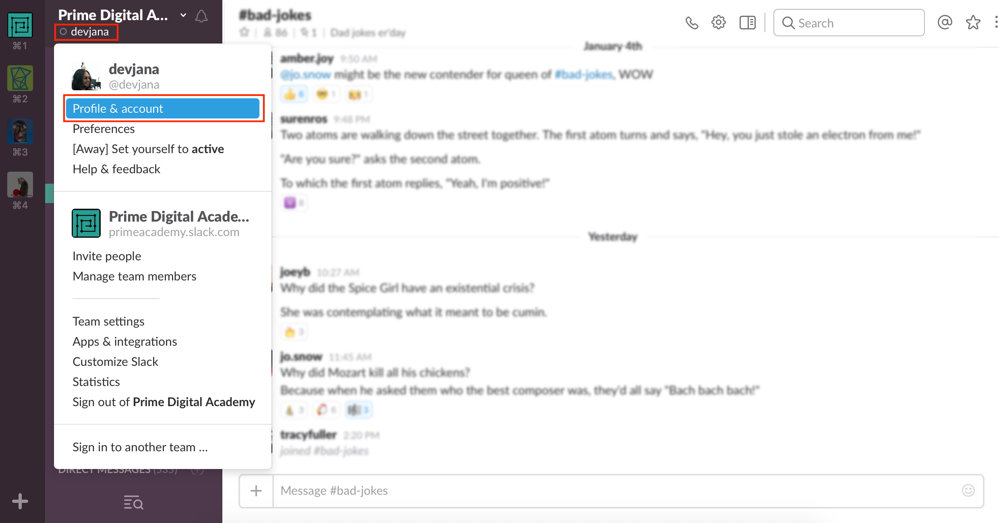
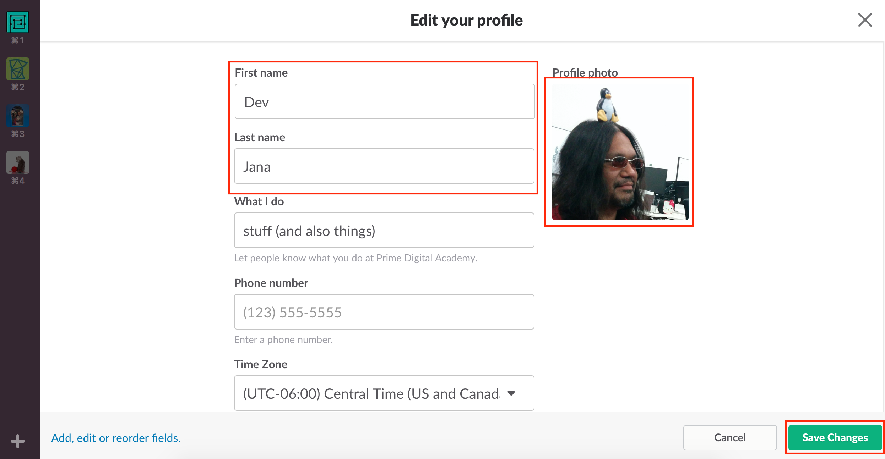
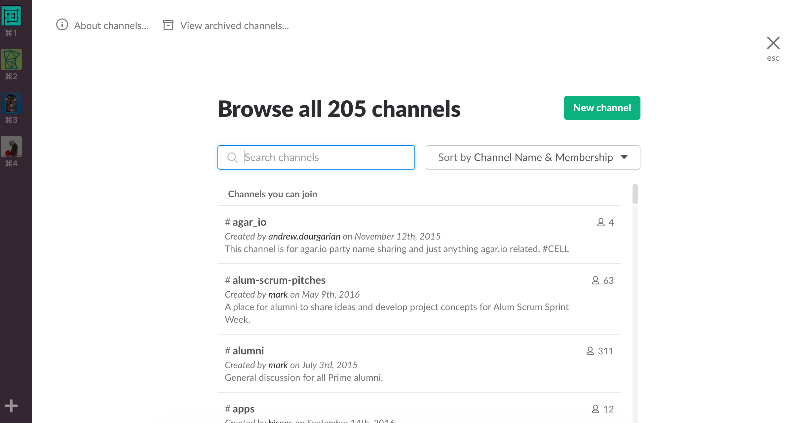
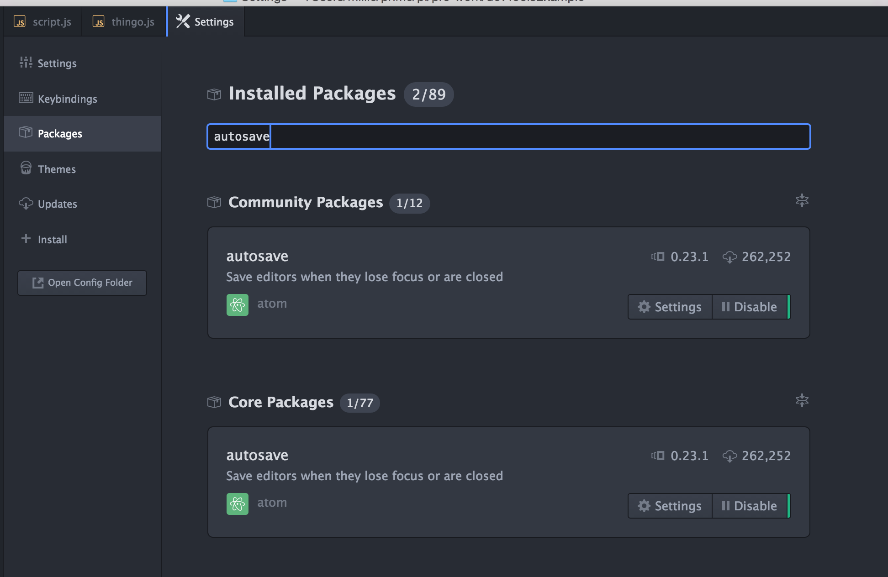
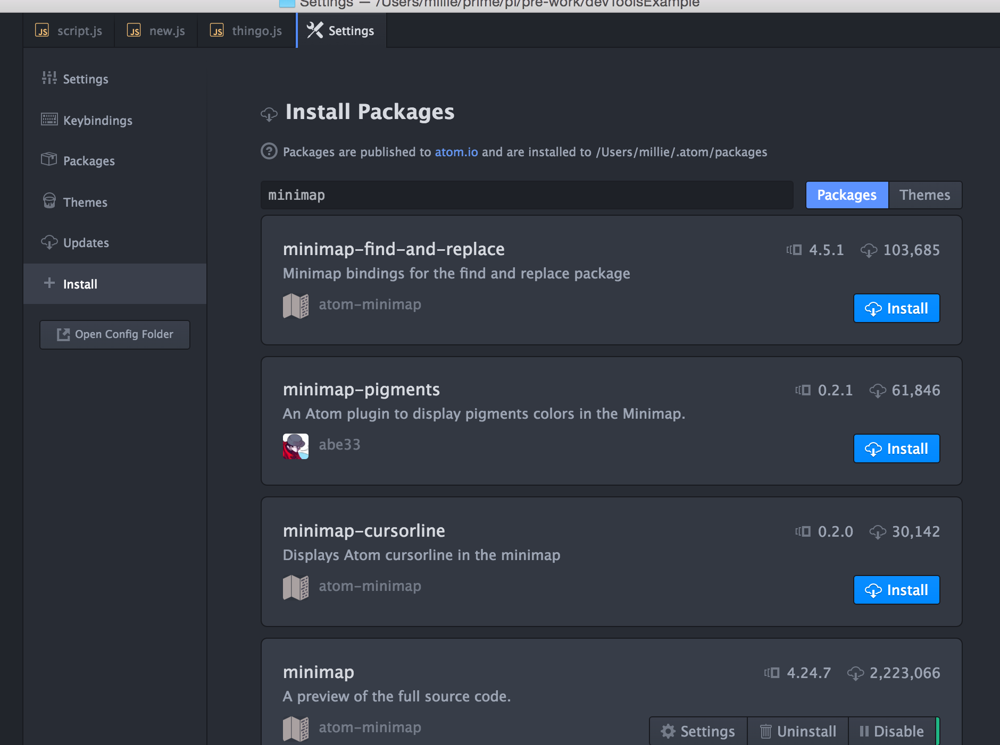
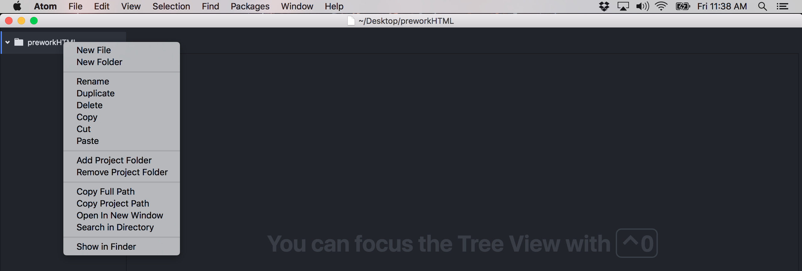

Prework Week 1
==============

Slack (our chat program):
-------------------------
Slack is a super popular chat program within the industry and you will find it ubiquitous throughout your time at Prime. Getting comfortable with using Slack is incredibly important and you'll want to make its regular use a habit ASAP.

You should have already been invited to the Slack Channel for your cohort and we recommend you install the slack app: https://slack.com/downloads/

Note: There is also a Slack app for mobile devices!

Make sure you set up your profile correctly. Once logged in, click on your user name and select "Profile & Account" from the popup menu.

Next, click "Edit Profile" in the profile overview.

Everyone should use their actual first and last name and a relatively recent pic of themselves for their profile.

There are many channels other than the one for your cohort. Take a few moments to browse them by clicking the word "Channels" (not the + next to channels). You can subscribe to any of the public channels at Prime.

You can also "star" channels that are high priority for you. If you subscribe to multiple channels, we highly recommend you star your cohort's channel. 

Please, feel free to jump in to channels and join the conversations!

Atom (our IDE):
--------------

Install Atom and install a few useful plugins to help you work more affectively.

### Steps
- [Download Atom](#download-atom)
- [Default Functionality / Core Packages](#default-functionality--core-packages)
- [Community Packages](#community-packages)
- [Settings](#settings)

### Download Atom
- Download from here: [https://atom.io/](https://atom.io/)
- After downloading drag the Atom icon from Downloads to the Applications folder. 

- To keep Atom in your doc, right click on the open application item in your doc, select options and keep in doc.

-

### Default Functionality / Core Packages
Atom is the 'hackable text editor'. This means that the community that uses it, extends it via packages they write to add new functionality. As these packages become popular the "maintainers" (programmers that work on and are responsible for a software project) of atom can decide to make functionality default. 

To see what is installed by default or enable it, go to the preferences menu (also called settings). This is located in the Atom menu, select Preferences. A new tab will open called **Settings**. On the left hand side of this screen you should see a series of options: Settings, Keybindings, Packages, Themes, Updates, and Install. Select **Packages**.

### Community Packages

You can install the community packages. Here is a small list of some suggested ones. Note, some packages need you to restart atom before they take effect.

- [linter](https://atom.io/packages/linter)
- [linter-jshint](https://atom.io/packages/linter-jshint)
- [minimap](https://atom.io/packages/minimap)
- [open-in-browser](https://atom.io/packages/open-in-browser)

There are two ways to install community packages in atom. The first way is described below. If you are interested in installing things via the command line, there is a hard mode below that describes atom package manager (apm).

##### Install from Preferences
In the Preference menu, click **Install** on the left selection. In the search box, type the exact name of the package from the list above. As you see in the picture below many matches come up. Find the correct one and click the blue install button. Again, you might need to restart atom for the package to start working.

I already have installed minimap, so I don't have a blue button. 

Some packages require you launch them from the package menu. 

Git (our version control):
--------------------------
Setup

Implementation

Next Steps

Our first Javascript+HTML:
--------------------------
Setup

Next Steps

Posting our work to Github:
---------------------------
Setup

Implementation

Next Steps

Turning in our work through the Assignment App:
-----------------------------------------------
Setup

Implementation

Next Steps

